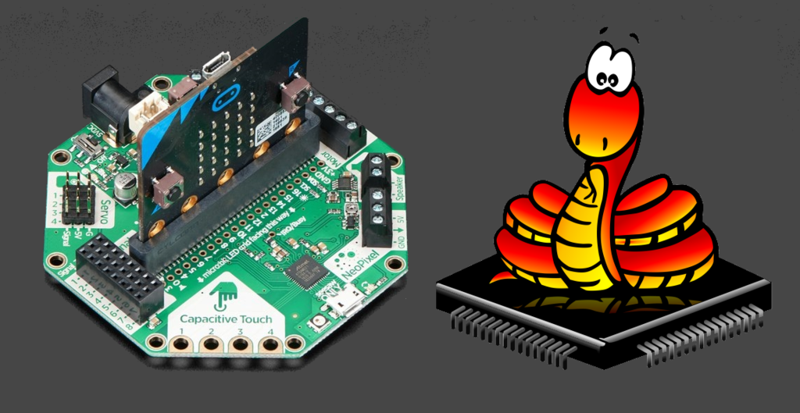

## Using micro:bit and CRICKIT with MicroPython

This code accompanies the [Adafruit Learning System](https://learn.adafruit.com) tutorial **Using micro:bit and CRICKIT with MicroPython**
https://learn.adafruit.com/using-micro-bit-and-crickit-with-micropython/

**Note this code is written in MicroPython, NOT CircuitPython**, as only MicroPython runs on the first generation micro:bit.

If you are looking to make changes/additions, please use the GitHub Issues and Pull Request mechanisms.

All code MIT License, please attribute to Adafruit Industries, Limor Fried

Please consider buying your parts at [Adafruit.com](https://www.adafruit.com) to support open source code
